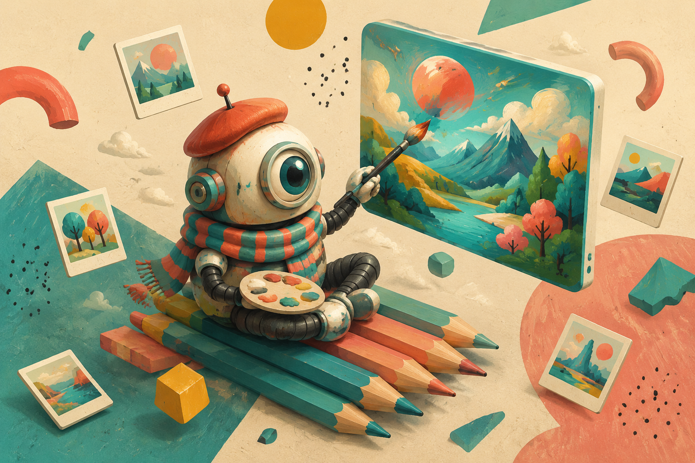
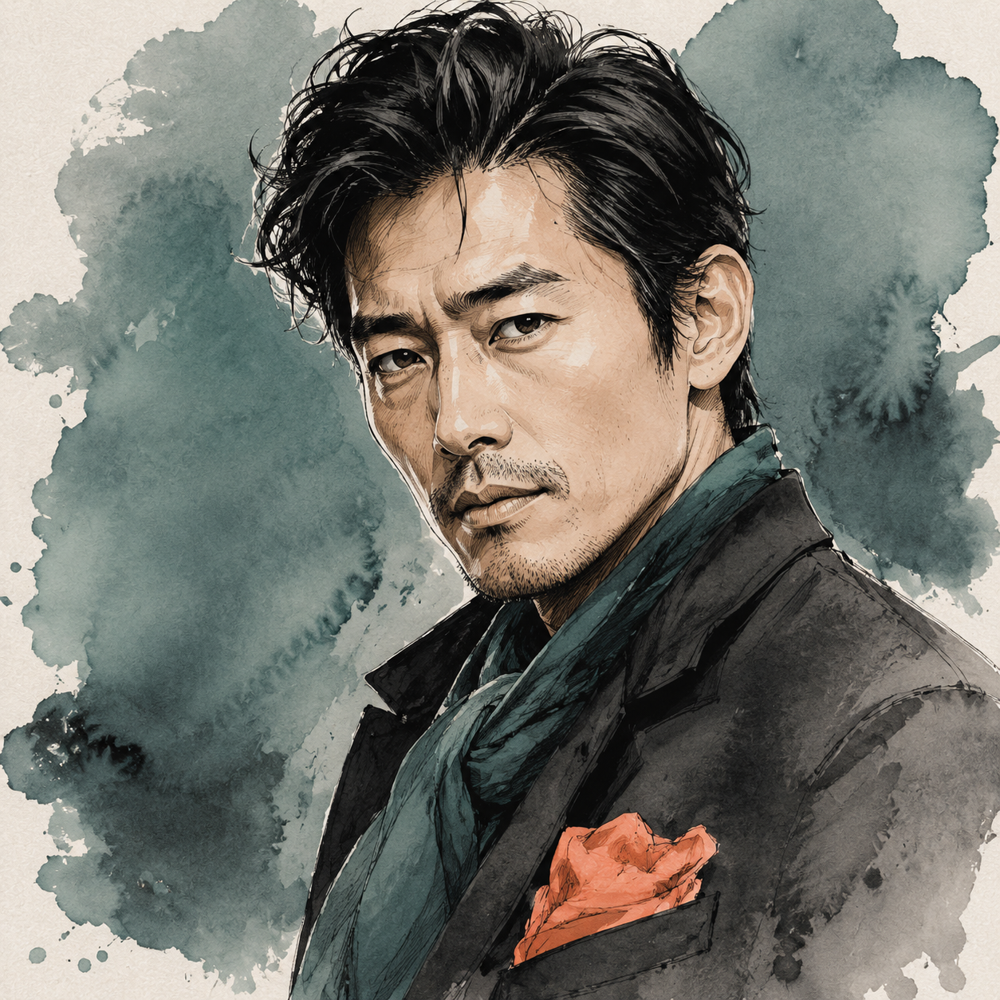
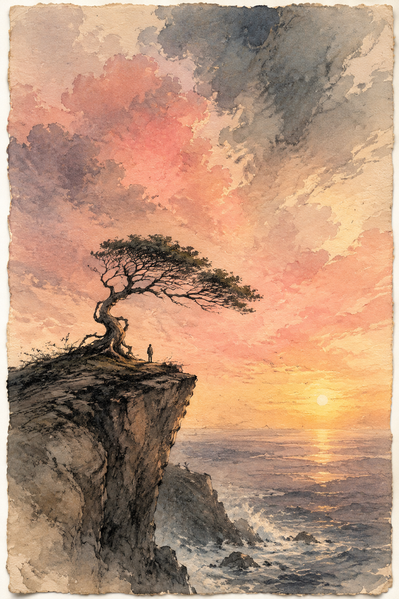
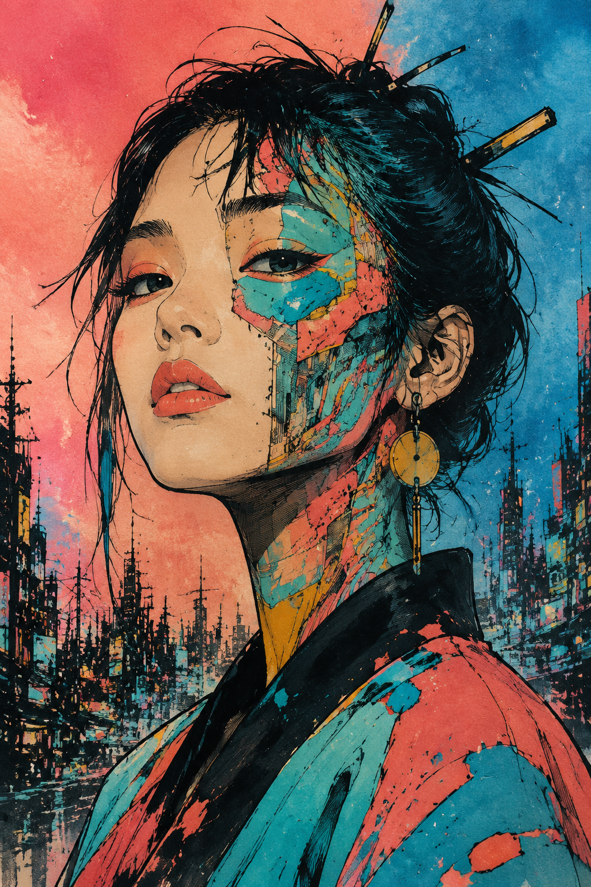
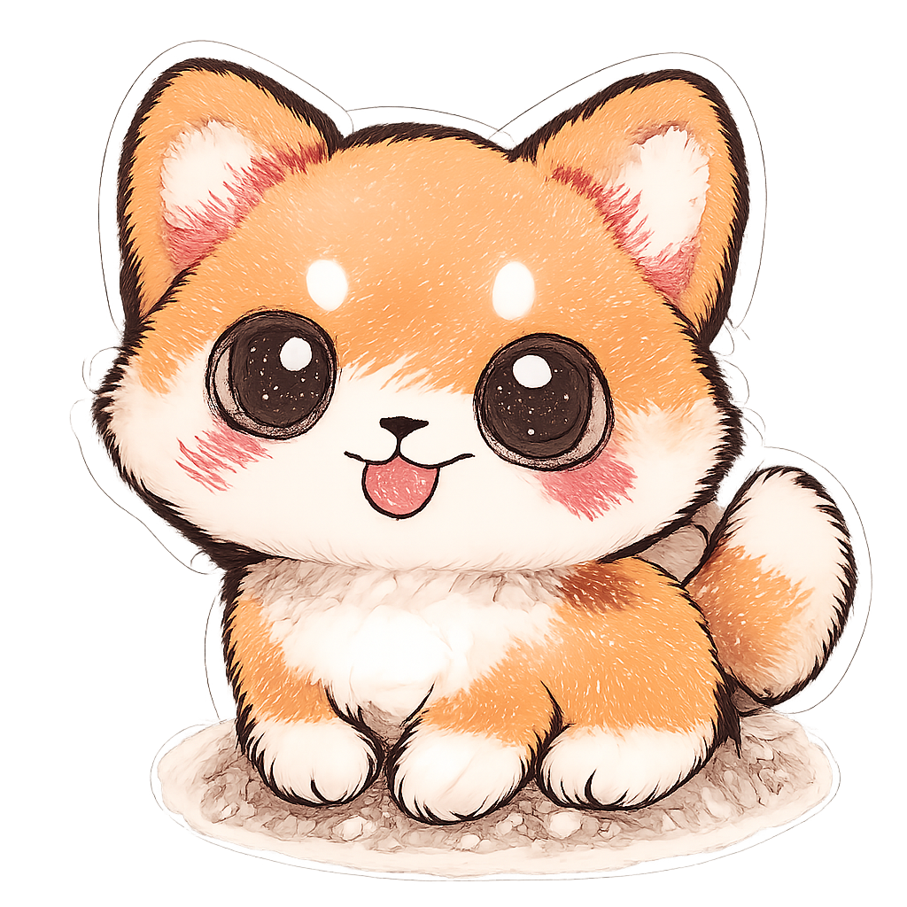
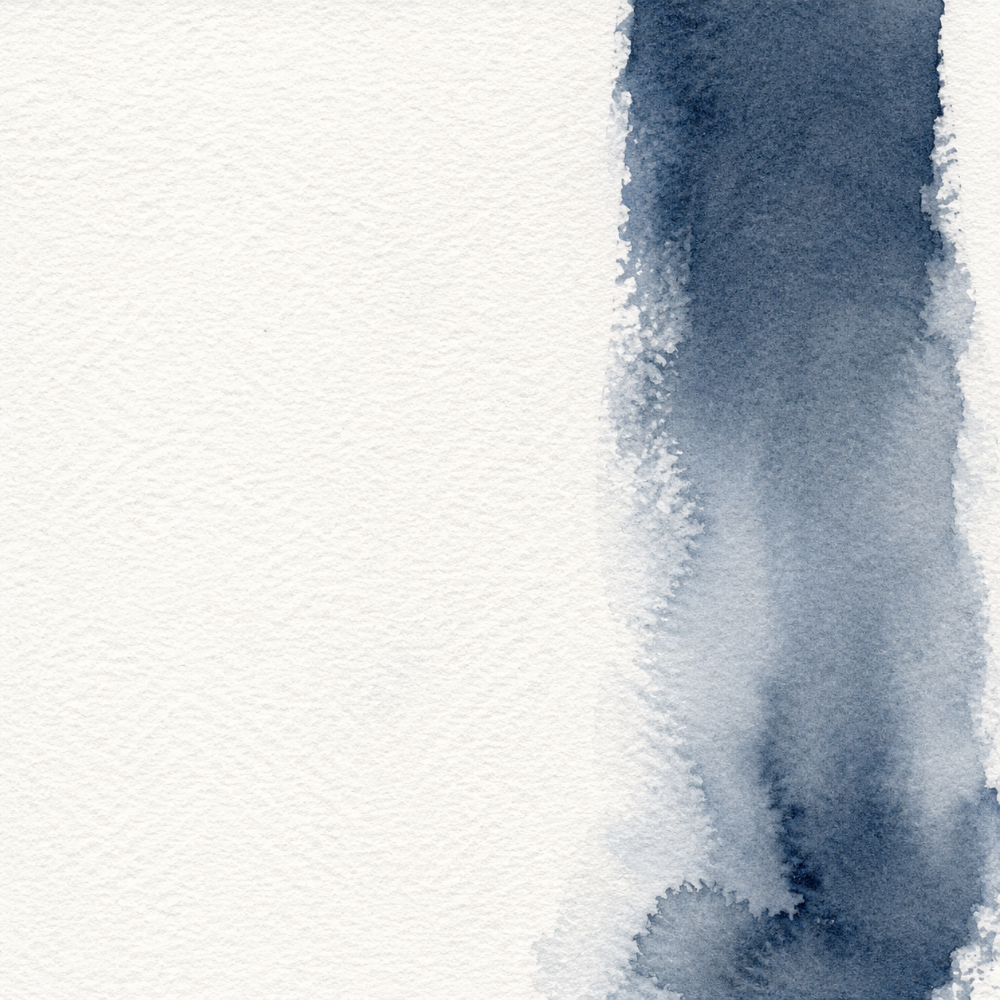
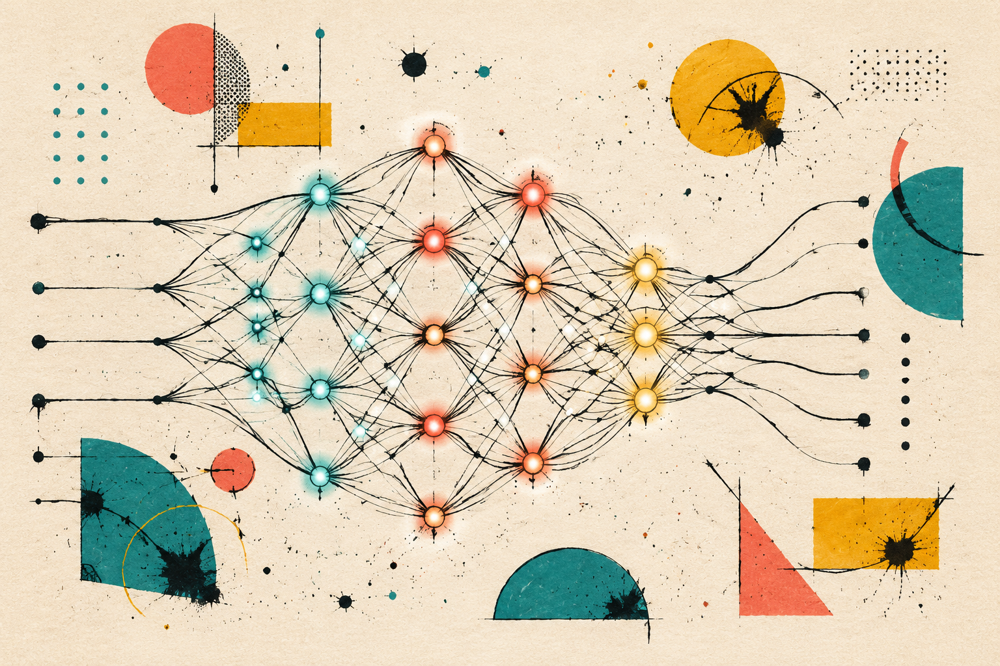

# APA · AI 图像生成 / 编辑 CLI

> 基于 OpenAI 兼容协议的 gpt-image-2 模型，覆盖办公所有常见场景。
> **抗 AI 痕迹的"手作感"打法** —— prompt 里加 `hand-painted` / `paper craft` / `Memphis palette` / `marker line art` 等关键词，把"塑料感"压下去。自带 10 张精选样图（[`samples/`](./samples)）和 75 个实战 prompt 模板（[`examples/`](./examples)），全部按这套思路写。


*↑ APA 一图看懂：AI 生图 / 改图 / 迭代，全流程。完整 10 张样图见 `samples/`*

## 一句话能力

| 能力 | 一条命令 |
|------|----------|
| 文生图 | `./bin/gpt-image generate --prompt "..." --preset ppt_cover_169` |
| 以图生图 | `./bin/gpt-image edit --image foo.png --prompt "改成夜景"` |
| 蒙版编辑 | `./bin/gpt-image edit --image foo.png --mask foo_mask.png --prompt "替换天空"` |
| 迭代工作流 | 每次出图自动记录到 `workspace/history.jsonl`，可回看、对比、复用 |

## 快速上手（3 步）

### 1. 装依赖

```bash
cd /path/to/apa
pip3 install -r requirements.txt
```

### 2. 配 key

编辑 `.env`（不是 `.env.example`）：

```ini
AI_API_BASE_URL=https://YOUR-API-HOST/v1
AI_API_KEY=YOUR_API_KEY
AI_MODEL=gpt-image-2
```

支持任意 **OpenAI 兼容** 的图像模型 API。

### 3. 出图

```bash
./bin/gpt-image generate \
  --prompt "Hand-drawn 2D flat illustration of a futuristic neural network, bold ink line art on cream cold-press paper texture, Memphis-style geometric accents in teal, coral, and mustard yellow, slightly imperfect hand-drawn lines, 8K, no text, no letters" \
  --preset ppt_cover_169 --quality hd
```

完整文档见 [`INSTALL.md`](./INSTALL.md) · [`SKILL.md`](./SKILL.md) · [`skill-spec.md`](./skill-spec.md)。

---

## 样图展示（`samples/`）

10 张精选样图全部走"抗 AI 手作感"路线：水彩 / 纸艺 / 手绘马克笔 / 孟菲斯配色。每张图都对应 [`examples/`](./examples) 里的一个 prompt，可直接复用修改。

| 商务男性头像（编辑插画） | 公益环保海报（复古水彩） | 抖音竖屏封面（手绘赛博朋克） |
|:---:|:---:|:---:|
|  |  |  |
| **食品电商特写** | **科技初创 Logo（剪纸工艺）** | **萌系柴犬贴纸（手绘马克笔）** |
|  |  |  |
| **PPT 章节分隔（单笔水墨）** | **PPT 封面（手绘神经网络）** | **PPT 封面（折纸球）** |
|  |  |  |

> 完整列表 + 抗 AI 关键词工具箱 + token 消耗：`samples/README.md`

## Prompt 模板（`examples/`）

9 个场景文件，75 个实战 prompt，每条都按"主体 / 风格 / 构图 / 光线 / 色彩 / 留白 / 负面提示 + 抗 AI 手作感关键词"写好：

- [`examples/ppt_cover.md`](./examples/ppt_cover.md) — PPT 封面（8 风格）
- [`examples/ppt_slide.md`](./examples/ppt_slide.md) — PPT 内页（7 模板）
- [`examples/avatar.md`](./examples/avatar.md) — 头像（7 类）
- [`examples/poster.md`](./examples/poster.md) — 海报（8 场景）
- [`examples/social.md`](./examples/social.md) — 社交媒体（7 模板）
- [`examples/ecommerce.md`](./examples/ecommerce.md) — 电商主图（8 模板）
- [`examples/logo.md`](./examples/logo.md) — Logo 底图（8 类）
- [`examples/sticker.md`](./examples/sticker.md) — 贴纸（8 模板）
- [`examples/banner.md`](./examples/banner.md) — 长条 Banner（8 模板）

每个 prompt 都有 **变体** 段和 **迭代改稿** 段，告诉你怎么个性化、怎么在原图基础上改稿。

## 文件结构

```
apa/
├── README.md          # 本文件
├── SKILL.md           # 完整文档（参数速查、FAQ）
├── INSTALL.md         # 安装与配置
├── skill-spec.md      # 交付说明
├── .env.example       # 配置模板
├── .env               # ← 你的实际配置（.gitignore，不入库）
├── requirements.txt   # python-dotenv
├── bin/
│   └── gpt-image      # bash 入口
├── lib/
│   ├── client.py      # CLI（generate / edit / history / preset）
│   ├── api.py         # OpenAI 兼容协议客户端（自动读 .env）
│   ├── presets.py     # 17 个办公场景预设
│   └── storage.py     # 历史记录
├── presets/
│   └── presets.json   # 比例别名 + 预设
├── examples/          # 60+ 实战 prompt 模板（9 文件）
├── samples/           # 10 张精选样图 + 索引
└── workspace/         # 你的生成图片 + history.jsonl
```

## 工作流：四步搞定一张图

```
1. 选预设        ppt_cover_169 / wechat_header / avatar_1k ...
2. 写 prompt     主体 + 风格 + 构图 + 光线 + 色彩 + 留白 + 负面提示
3. 第一次生成    --n 4 一次看多张，挑喜欢的
4. 迭代改稿      edit + 文字描述  OR  edit + mask 局部重绘
```

每次结果都存到 `workspace/`，自动写一行到 `workspace/history.jsonl`。
